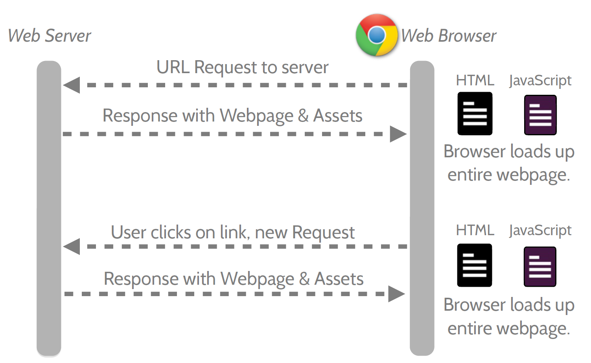
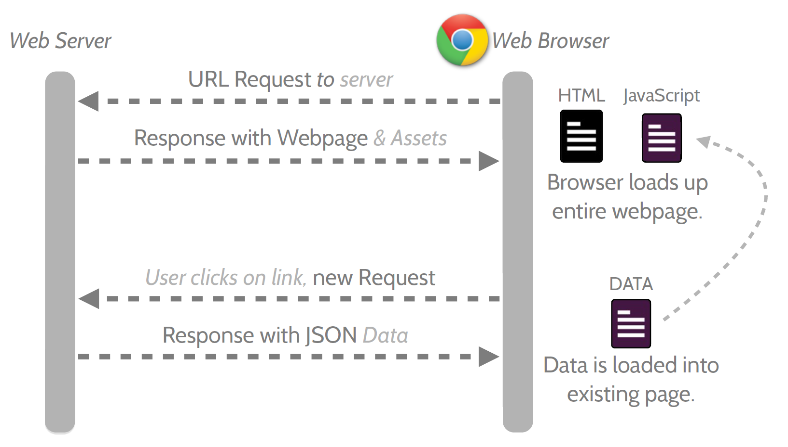
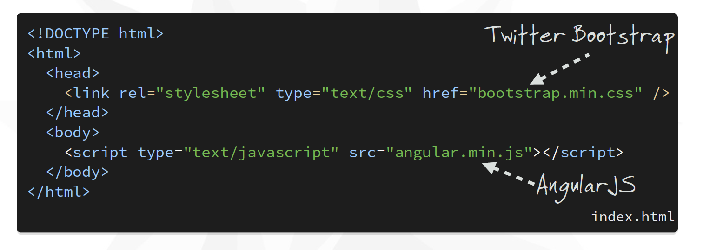
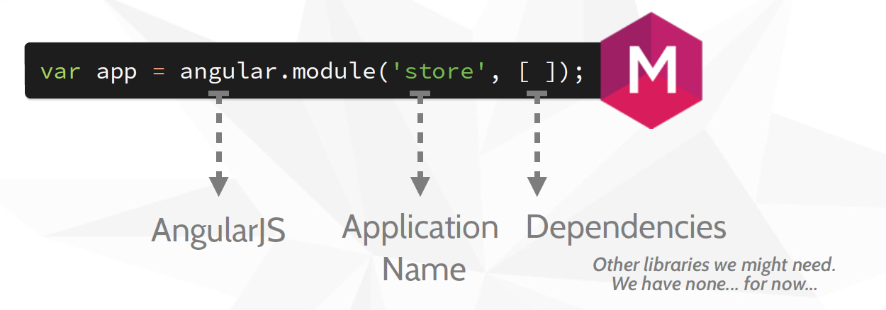
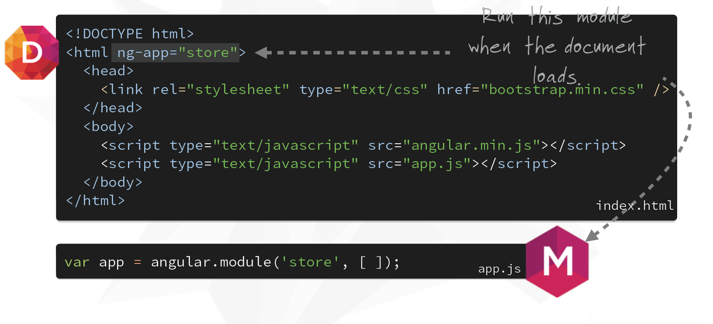

!SLIDE subsection ================

# AngularJS
### https://angularjs.org/
### JavaScript toolkit for building single page web apps
#### *(by the way this is AngularJS already)*

!SLIDE left ===================

# The tools you need

* nodejs: https://nodejs.org/
* nodejs tools:

    - **Bower**: JS package mananger http://bower.io/
    - **Karma**: unit test runner
    - **Protractor**: end to end (E2E) test runner
    - Grunt or even better **Gulp**: building systems (watch files while developing, minify etc.)

* **a web server** (for testing Http-Server, local-web-server etc.)

!SLIDE left ===================

# Why AngularJS

* by Google, well developed and maintained, wide adoption

* Angular helps you organize your JavaScript

* Angular helps create responsive (as in fast) websites.

* Angular is flexible and extensible: plays well with jQuery, Bootstrap, lots of extensions

* Angular is easy to test (unit and E2E)

!SLIDE left ======================

## The classic roundtrip

!SLIDE left ======================

## The AngularJS roundtrip

!SLIDE left ======================

## The HTML references

!SLIDE left ======================

## Angular modules

- Define a "scope" for Angular
- Define dependencies

!SLIDE left ======================

## Boostrapping AngularJS

- Use an "ng-app" attribute to specify the module

!SLIDE back ======================

# Demo
