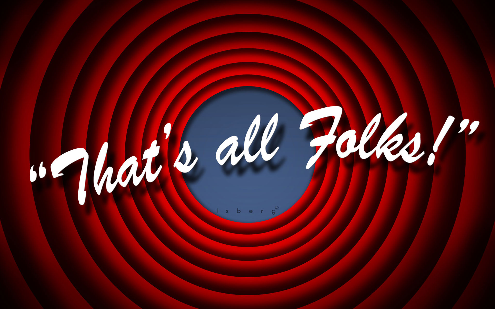

!SLIDE subsection ================

# It might help to know

!SLIDE left ======================

# A good start

## There is an Angular seed app to start from:

https://github.com/angular/angular-seed

## There is a style guide

https://github.com/johnpapa/angular-styleguide

!SLIDE left ======================

# check out

- the **folder structure**

- the unit tests with **Jasmine** \*_test.js, \*_spec.js: https://docs.angularjs.org/guide/unit-testing

- E2E tests via **Protractor**
https://docs.angularjs.org/guide/e2e-testing

- use **bower for dependencies**: http://bower.io/

- grunt or **gulp**: watch files, minification, sass/less compiler, uglify, hashing...

!SLIDE left ======================
# What's coming

- Angular Material
https://material.angularjs.org/latest/#/

- Angular 2
https://angular.io/

https://angular.io/features.html

    - mobile first
    - future ready: ECMAScript 6 (ES6)
    - free language
    - speed
    - new routing
    - internationalization
    - etc...

!SLIDE subsection ================

# A Material Design demo

!SLIDE back ======================

